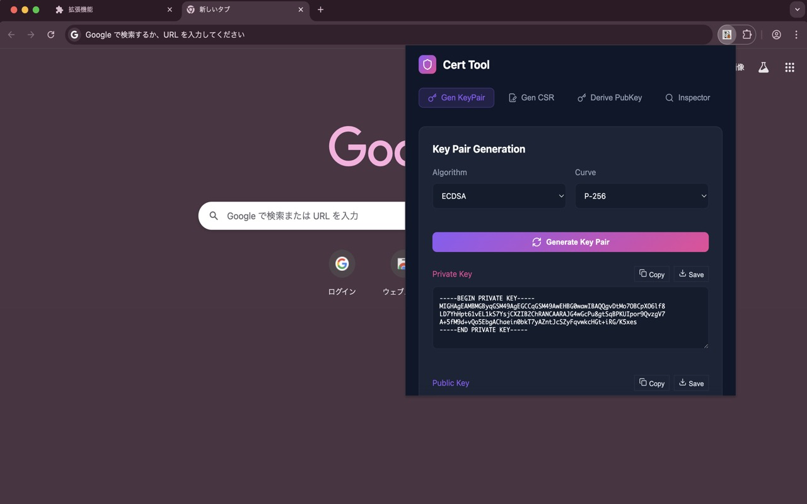
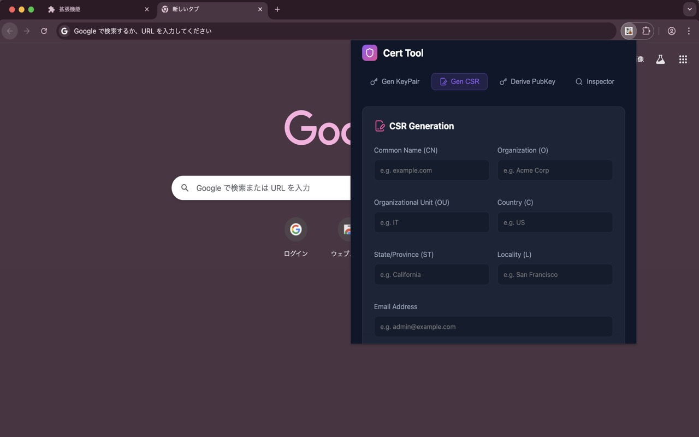
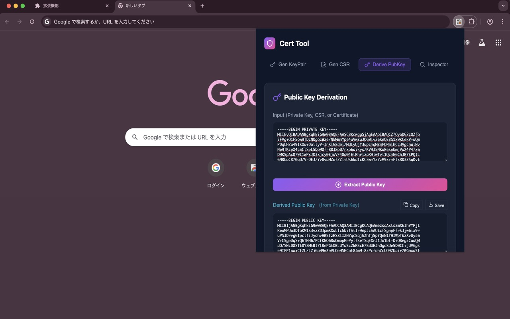

# Cert Tool Chrome Extension

A powerful and elegant Chrome extension for handling X.509 certificates and cryptographic keys. Designed with a premium dark-mode interface and glassmorphism aesthetics.

## Features

### 1. Key Pair Generation
Generate cryptographic key pairs instantly using the Web Crypto API.

- **Algorithms**: RSA (2048, 4096 bits), ECDSA (P-256, P-384, P-521), and Ed25519.
- **Standard Formats**: Private keys are exported in **PKCS#8** and public keys in **SPKI**.
- **Save As**: Easily download keys with a standard OS save dialog.

### 2. CSR Generation
Create Certificate Signing Requests (CSR) with a user-friendly form.

- **Customizable DN**: Set Common Name, Organization, Country, and more.
- **SAN Support**: Add multiple Subject Alternative Names (DNS, IP, Email, URI).
- **Flexible Signing**: Sign the request using your own private key.

### 3. Public Key Derivation
Extract the public key component from various sources.

- **Input Types**: Supports Private Keys (PKCS#8/PKCS#1), Certificates, or CSRs.
- **Auto-Detection**: Automatically identifies the input type and algorithm.

### 4. Certificate/CSR Inspector
View detailed information about certificates and signing requests.

- **Comprehensive View**: Shows Serial Number, Subject, Issuer, Validity, and Public Key details.
- **Extension Decoding**: Human-readable decoding for SANs, Basic Constraints, Key Usage, and Extended Key Usage (EKU).

## Installation

1. Clone this repository.
2. Run `npm install` to install dependencies.
3. Run `npm run build` to generate the production build in the `dist` folder.
4. Open Chrome and navigate to `chrome://extensions`.
5. Enable "Developer mode" (top right).
6. Click "Load unpacked" and select the `dist` directory.

## Technology Stack
- **Framework**: Vite + React + TypeScript
- **Crypto Library**: [node-forge](https://github.com/digitalbazaar/forge) & Web Crypto API
- **Icons**: [Lucide React](https://lucide.dev/)
- **Styling**: Vanilla CSS with Glassmorphism effects

---
Developed with focus on security, usability, and modern aesthetics.
